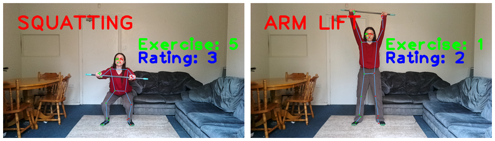
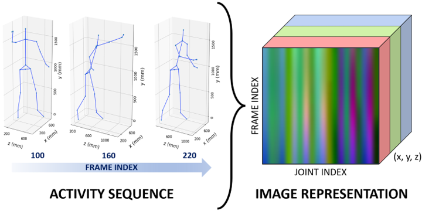
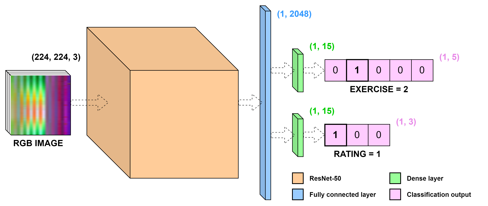
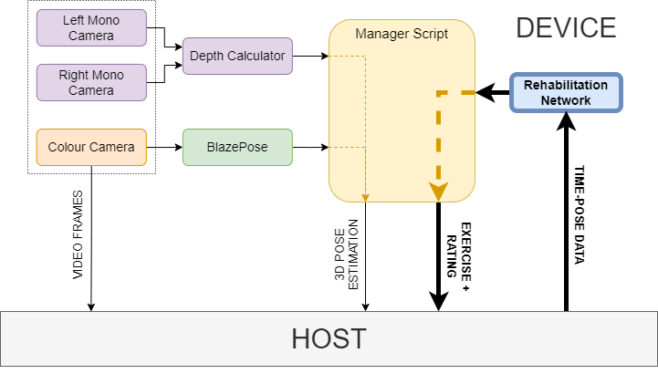

# Introduction

## *AID: An AI Camera Platform to Aid Telerehabilitation with Autonomous and Real-Time Performance Feedback*

Unsupervised physical therapy often leads to poor adherence, longer treatment durations and increased healthcare expenses. One solution is to use vision sensors to track patient motions and provide feedback. AI cameras (vision sensors with integrated artificial intelligence chips) like the OAK-D can run computer vision algorithms, such as pose estimation, within their hardware, making them a lightweight and practical alternative to RGB-D sensors such as the Kinect, which requires a GPU for inference. 

The purpose of this study was to determine the OAK-D's potential as a "plug-and-play" telerehabilitation device, by creating an autonomous system for exercise performance feedback in real-time. Using 3D body tracking data, we trained a custom network to predict and score rehabilitation exercises. This network was combined with the efficient BlazePose algorithm to create a pipeline for real-time assessment, running solely on OAK-D hardware. 

The network yielded a 94.3\% rating classification accuracy on the KIMORE dataset, and the pipeline showed an exercise classification accuracy of 84\% running at 20fps on the OAK-D. The results indicate that the OAK-D is a promising low-cost solution for autonomous "plug-and-play" telerehabilitation, though further research is needed to confirm its accuracy in a clinical setting.

## Repository contents

This repository contains all the code used in our research project. This document details how to reproduce our work, from pre-training ResNet-50 on MoVi motion capture data, to re-training for KIMORE exercise classification and assessment, to integrating this network in a DepthAI pipeline for running the system on OAK-D hardware.

In this repository, you will find:
- `docs`: the poster and thesis written about our project 
- `movi`: code to transform MoVi files into *time-pose* images, and subsequently to pre-train ResNet-50 on motion capture data 
- `kimore`: code to transform KIMORE files into *time-pose* images and exercise ratings, and subsequently to re-train our network to classify and assess KIMORE rehabilitation exercises
- `depthai_blazepose_telerehab`: a repository containing the working telerehabilitation pipeline; a fork of the [original DepthAI BlazePose repository](https://github.com/geaxgx/depthai_blazepose), integrated with our telerehabilitation system

 

# Methods

## *Time-Pose* images

The idea was to re-train an image classification architecture (ResNet-50) on image representations of motion tracking sequences, enabling the classification of exercises and performance ratings.

From the thesis (*Section 4.1.1 - Transfer Learning with ResNet-50*):

> Joint position data is often provided as 3D coordinates for each joint within
the topology of a skeleton model. Therefore, for a body tracking sequence, the
data has dimensions (frame index, joint position index, coordinates). This is
similar to the shape of an image: (height, width, channels), where the ‘channel’
dimension represents the pixel intensity of each of Red, Green and Blue. The
similarity of dimensions between pose information and images enabled us to
convert data from action recognition sequences into an RGB input format;
consequently, the ResNet-50 architecture would be able to classify the activities
within each sequence similarly to how it classifies objects within images.

From the poster:

> A visualisation of a "throw/catch" motion sample from MoVi (pre-normalisation), with dimensions *[frames, joints, coordinates]*, and its ResNet-50 image representation with dimensions *[224, 224, 3]*.

## Skeleton topology normalisatioon

We used three different skeletons within our training pipeline: MoVi, Kimore, and BlazePose. To enable compatibility, we created a fourth topology, and normalised all skeletons accordingly.

Normalisation consisted of:

- Keeping 19 common joints between KIMORE and BlazePose
- Using the BlazePose joint ordering system (the order of joint indexes used when generating *time-pose* images)
- Setting the coordinate origin to the mid-hips
- Scaling each skeleton using the distance from the mid-hips to the mid-shoulders
- Using the BlazePose axis system (scale, order and magnitude of x,y,z)

From the thesis (*Section 4.3.2 - Topology Normalisation*):

> The skeletal topologies for pose estimation used by the MoVi and KIMORE datasets, in comparison to the BlazePose topology, and our normalised model. Our model consists of joints which are present for both KIMORE and BlazePose, with the origin set to the mid-hips and the skeleton scaled with respect to the distance between the new origin and a reference point - the mid-shoulders.

 

# MoVi

The publicly-available MoVi dataset can be found [here](https://borealisdata.ca/dataset.xhtml?persistentId=doi:10.5683/SP2/JRHDRN). This project uses the two files `F_Subjects_1_45.tar` and `F_Subjects_46_90.tar`, which both contain subject data as `.mat` files. We unzipped and combined these `.tar` files into one folder named `F_Subjects_Data`. 

Another essential tool from MoVi is a utilities file `utils.py` found in the [MoVi-Toolbox repo]("https://github.com/saeed1262/MoVi-Toolbox/blob/master/"). We use two functions from this script: `mat2dict` and `dict2ntuple`.

To reproduce our work, download the `utils.py` file to the `MoVi` repo, and move the `F_Subjects_Data` folder into this repo too.

These are the scripts included in our MoVi folder:
- `dataset_info.py`: prints out information about the mat files
- `dataset_info.sh`: calls `dataset_info.py` on all `.mat` files in `F_Subjects_Data`
- `movi2img.py`: generates an image from a 120-frame window of each MoVi motion capture sequence, after applying normalisation to the skeleton 
- `movi2img.sh`: calls `mocap2img.py` on all `F_Subjects_Data`
- `movi_resnet.py`: trains a ResNet-50 image classification network to classify MoVi motion capture actions from the image data. Uses different parameters, saves each model and also saves loss and accuracy graphs to allow for choosing the model with the best set of parameters.

 

# KIMORE

The publicly-available KIMORE dataset can be found [here](https://vrai.dii.univpm.it/content/KiMoRe-dataset). There are two folders: CG and GPP, containing the control group and patient group data respectively. To reproduce our work, download both the CG and GPP folders to the KIMORE repo.

From the thesis (*Section 4.2.3 - Training*):

.

> The input layer matches the dimensions of the RGB image, which is followed by the imported ResNet-50 layers, including the fully-connected feature vector, which acts as input to both of the Dense layer branches for exercise and rating classification respectively. Outputs are provided as probability vectors, such that the maximum-likelihood classification from the network is equal to the vector index with the largest value.

These are the scripts included in our KIMORE repo:
- `dataset_analysis.ipynb`: collates all KIMORE data into a DataFrame and plots the data in various graphs
- `kimore2img.py`: generates an image from 90-frame sliding windows (with 45-frame overlap) of each KIMORE motion capture sequence, after applying normalisation to the skeleton
- `kimore_preprocessing.ipynb`: generates a `.h5` list of dicts, where each dict contains an image and its data (subject, exercise, clinical score, rating, etc). This object is used as input to train the neural network.
- `kimore_resnet.py`: retrains the pre-trained ResNet-50 network to classify both KIMORE exercises and their ratings from the image data. Uses checkpoint callbacks to save the best version of the model as a TensorFlow SavedModel.

 

# DepthAI-BlazePose Integration

This is a fork of an existing *depthai_blazepose* Github repository, which can be found [here](https://github.com/geaxgx/depthai_blazepose).

To run the pre-trained ResNet-50 network on the OAK-D's VPU, the TensorFlow model had to be converted to a BLOB file. We used the Luxonis Blob Converter tool to do this, which can be found [here](https://blobconverter.luxonis.com/). 

To recreate our work, convert your TensorFlow SavedModel to a BLOB file, and place the converted model in the `models` directory. We have included our final BLOB model `telerehab_sh8.blob` in this folder, which was compiled with 8 shaves.

The diagram above shows a high-level representation of the full telerehabilitation pipeline, which runs on the OAK-D hardware, including the communication channels between the OAK-D and the Host laptop. 

The purple boxes represent the depth system: the left and right monocular cameras feed into the depth calculator, which sends its outputs to the Manager Script. The colour camera, shown in orange, passes data to BlazePose, shown in green, which then outputs to the Manager Script. The colour camera also sends video frames to the host. 

On the right-side of the diagram, our telerehabilitation system is shown in bold. The host sends *time-pose* data to the rehabilitation network, shown in blue, which then outputs to the Manager Script. 

The Manager Script, in yellow, combines the depth and BlazePose data and outputs a 3D pose estimation to the Host laptop. It also takes the rehabilitation network predictions and outputs an exercise and rating classification to the Host.

These are the scripts that we have edited, which differ from those in the original implementation:
- `BlazeposeDepthaiEdge_telerehab.py`: a pipeline for running BlazePose on-device. We added functionality to collect pose data in a 90-frame buffer, convert this data into RGB images, and input the images to our pre-trained ResNet network.
- `template_manager_script_telerehab.py`: a script for managing the inputs and outputs of the OAK-D and host systems. We appended the exercise and rating outputs to a dictionary of data sent to the host computer, enabling the display of this information to the subject.
- `telerehab_demo.py`: found in the `examples` directory. This demo will track the user's pose using BlazePose, and output predictions of their exercise and performance rating on the screen every 90 frames (4-5 seconds).
- `telerehab_evaluation.py`: found in the `examples` directory. This was the Python file used for data collection for the Results and Discussion section of the thesis and paper. The system instructs the subject on which exercise to perform at a time, and saves the pose tracking data in a `.csv` file. 
